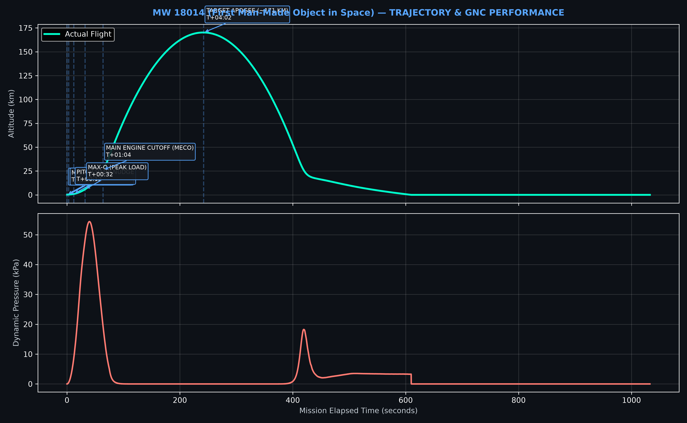

# MW 18014 (First Man-Made Object in Space)
**Era:** Epoch_01_Sounding_Rockets | **Vehicle:** Aggregat-4 (V-2) | **Epoch Date:** 1944-06-20

---

## 1. Flight Recordings
- **Primary Flight Capture (KSP):** [Watch Video Recording](https://www.youtube.com/watch?v=REPLACE_ME_KSP)
- **Synchronized Telemetry Stream (OBS HUD):** [Watch Telemetry Stream](https://www.youtube.com/watch?v=REPLACE_ME_HUD)

---

## 2. Trajectory & Telemetry Verification

---

## 3. Flight Sequence Milestones
- T+00:00 - **PRE-STAGE IGNITION**: 
- T+00:03 - **MAIN STAGE LIFTOFF**: 
- T+00:12 - **PITCH VANE NUDGE**: 
- T+00:32 - **MAX-Q (PEAK LOAD)**: 
- T+01:04 - **MAIN ENGINE CUTOFF (MECO)**: 
- T+04:02 - **TARGET APOGEE (~171 KM)**: 

---

## 4. Vehicle Specifications & Documentation
- [View Construction & Build Profile](build_profile.md)
- [View Flight Debrief Notes](mission_notes.md)
- [View Mission Parameters (YAML)](manifest.yaml)
- [View Executed Guidance Script](flight_profile.py)
- [Download Raw CSV Telemetry](data/1944_A4_MW18014_Flight_15_telemetry.csv)
